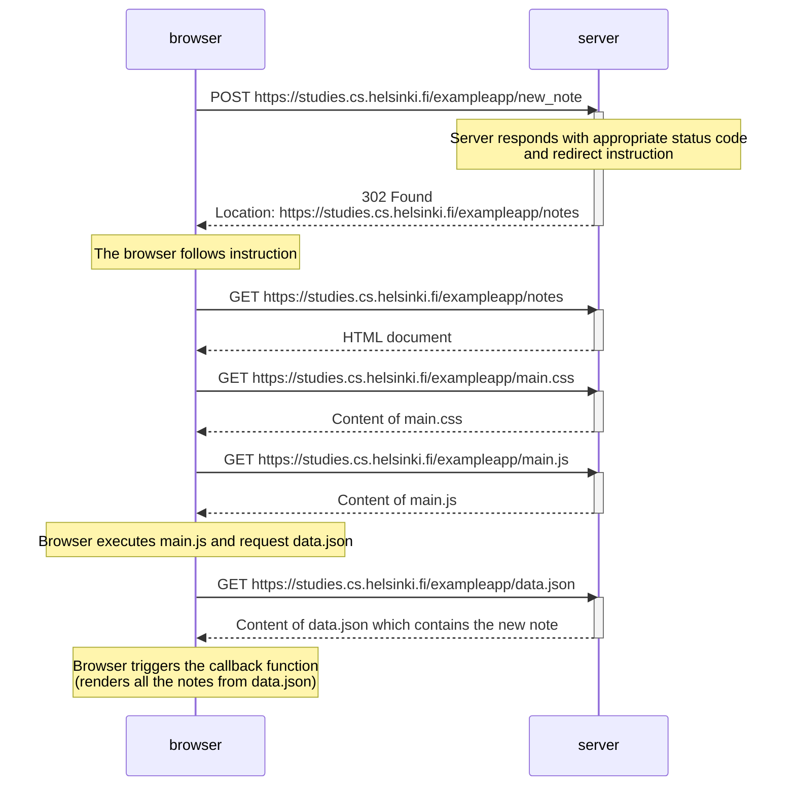

```mermaid
sequenceDiagram
    participant browser
    participant server

    browser->>server: POST https://studies.cs.helsinki.fi/exampleapp/new_note
    activate server
    Note over server: Server responds with appropriate status code<br> and redirect instruction
    server-->>browser: 302 Found<br>Location: https://studies.cs.helsinki.fi/exampleapp/notes
    deactivate server

    Note over browser: The browser follows instruction
    browser->>server: GET https://studies.cs.helsinki.fi/exampleapp/notes
    activate server
    server-->>browser: HTML document
    deactivate server


    browser->>server: GET https://studies.cs.helsinki.fi/exampleapp/main.css
    activate server
    server-->>browser: Content of main.css
    deactivate server

    browser->>server: GET https://studies.cs.helsinki.fi/exampleapp/main.js
    activate server
    server-->>browser: Content of main.js
    deactivate server

    Note over browser: Browser executes main.js and request data.json
    browser->>server: GET https://studies.cs.helsinki.fi/exampleapp/data.json
    activate server
    server-->>browser: Content of data.json which contains the new note
    deactivate server

    Note over browser: Browser triggers the callback function<br>(renders all the notes from data.json)
```